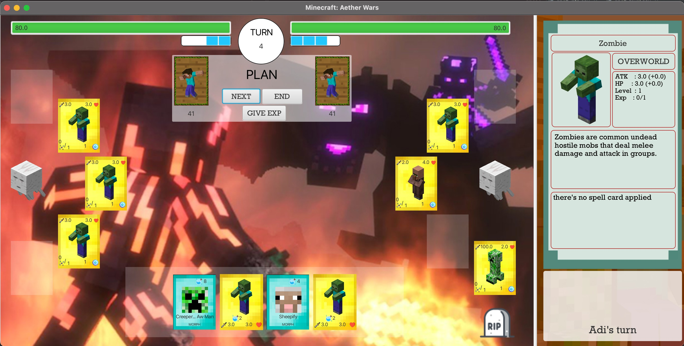

# Tugas Besar 2 IF2210 OOP


<div align="center">
Image Credit<br>
https://www.youtube.com/watch?v=yCNUP2NAt-A
</div>

<br>

> Membuat game kartu <em>turn based</em> untuk 2 pemain yang dimana pemain nantinya dapat bermain secara bergantian pada 1 layar yang sama. Tujuan dari game ini adalah menghabiskan <em>health points</em> (HP) musuh. HP dapat berkurang apabila terkena serangan dari kartu karakter yang diletakkan di board.<br><br>
> Ada pula peraturan dari permainan ini sebagai berikut:<br>
> a. Nama yang di <strong>hardcode</strong><br>
> b. Atribut <strong><em>health points</em></strong> (HP) sebesar <strong><em>80</em></strong><br>
> c. Mana yang jumlahnya bertambah setiap giliran<br>
> d. <em>Deck</em> yang berisi 40-60 kartu<br>
> e. Kartu <em>hand</em> sejumlah <strong>maksimal</strong> 5 kartu.

## Daftar Anggota Kelompok

<table>

<tr><td colspan = 3 align = "center">KELOMPOK 01 KELAS 02</td></tr>
<tr><td align="center">No</td><td align="center">Nama</td><td align="center">NIM</td></tr>
<tr><td align="center">1</td><td>Suryanto</td><td>13520059</td></tr>
<tr><td align="center">2</td><td>Wesly Giovano</td><td>13520071</td></tr>
<tr><td align="center">3</td><td>Vieri Mansyl</td><td>13520092</td></tr>
<tr><td align="center">4</td><td>Brianaldo Phandiarta</td><td>13520113</td></tr>
<tr><td align="center">5</td><td>Steven</td><td>13520131</td></tr>
<tr><td align="center">6</td><td>Aldwin Hardi Swastia</td><td>13520167</td></tr>

</table>

## Teknologi dan Library yang Digunakan

-   Java
-   Gradle
-   IntelliJ IDEA
-   JavaFX
-   JUnit
-   Scene Builder

## Cara Memakai

1. Clone/Download Repository ini
2. Jalankan terminal
3. Ketikkan

    ```bash
    ./gradlew run
    ```

## Tampilan GUI Apliksi



## Credit

Minecraft images and description are taken from [Minecraft Wikia](https://minecraft.fandom.com/wiki/)
Other sources for "random" images are:

-   Album Supporteran STEI 2018 :D
-   https://mobile.twitter.com/masterlimbad6
-   https://www.nationalgeographic.com/science/article/141104-kamikaze-kublai-khan-winds-typhoon-japan-invasion
-   https://open.spotify.com/album/3GzwPyPZCyrqUTaurTaS23
-   https://cdn.wccftech.com/wp-content/uploads/2021/06/nvidia-geforce-rtx-3080-ti-product-gallery-photo-003-scaled.jpg
-   https://twitter.com/GGumiliar
-   https://dota2.fandom.com/wiki/Spectre
